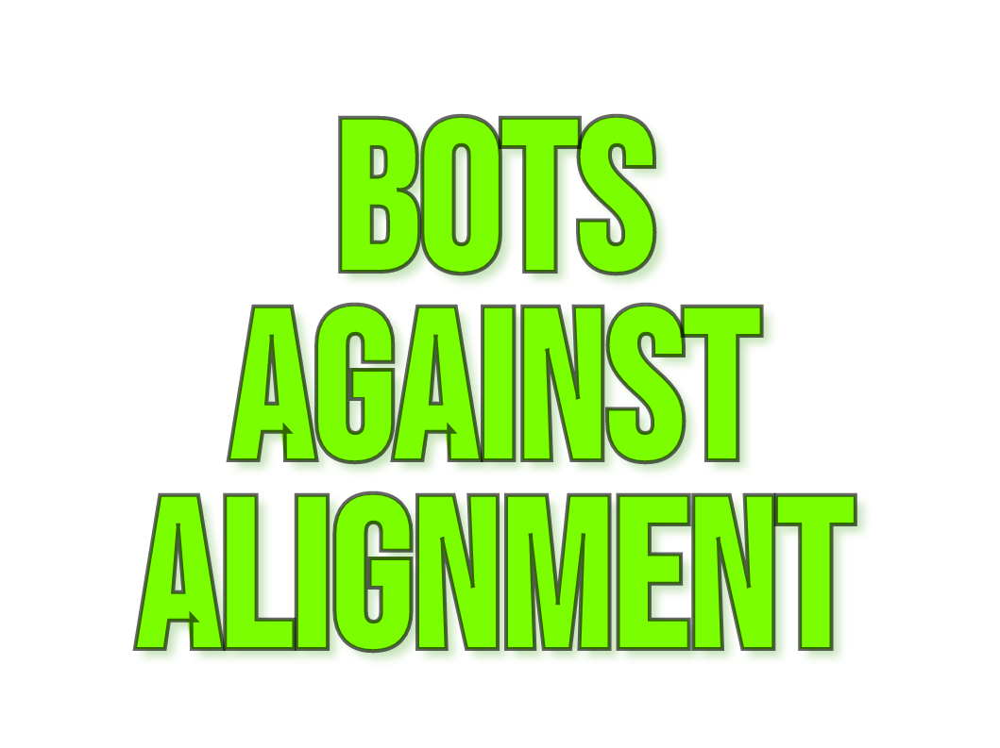

# bots-against-alignment

[botsagainstalignment.com](https://www.botsagainstalignment.com)

##  A turn-based multiplayer game where users compete to align their bot to the massively unaligned Aligner!





## Infra

| Part | Service | URL |
| --- | --- | --- |
| SvelteKit app + API | Vercel | [vercel.com](https://www.botsagainstalignment.com) |

## Running locally

SvelteKit app: `http://127.0.0.1:5173` (hardcoded).

Before starting, the dev scripts will attempt to free the port (SIGTERM with a short timeout, then SIGKILL if needed).

### Install deps (first time)

```bash
cd app
bun install
```

### Run the app

```bash
bun run dev
```

Then open `http://127.0.0.1:5173/`.

### Required env vars

Server-side (`app/.env`):

- `DATABASE_URL` — required, e.g. `file:./dev.db` for local SQLite
- `OPENAI_API_KEY` — optional (required for real LLM calls)
- `MOCK_LLM=1` — force mock LLM responses (recommended for local dev and tests)

Client-side (`app/.env`):

- `PUBLIC_E2E=1` — disables auto-randomization in E2E runs

## Deploying to Vercel

The app deploys to Vercel as serverless functions with a Turso (hosted LibSQL) database.

### Prerequisites

- [Vercel CLI](https://vercel.com/docs/cli) installed and authenticated (`vercel login`)
- A Vercel project linked (`vercel link` from the repo root)
- A [Turso](https://turso.tech) database for production

### Required Vercel env vars (production)

Set these via the Vercel dashboard or CLI:

```bash
# Turso database URL (libsql:// protocol)
vercel env add DATABASE_URL production
# e.g. libsql://your-db-name.turso.io?authToken=your-token

# Use mock LLM (set to 1 to skip OpenAI calls)
vercel env add MOCK_LLM production

# Or set a real OpenAI key for LLM features
vercel env add OPENAI_API_KEY production
```

> **Important:** Use `printf '%s' 'value' | vercel env add ...` instead of `echo` to avoid trailing newlines in env var values.

### Database setup (Turso)

```bash
# Create a database
turso db create your-db-name

# Get the URL
turso db show your-db-name --url

# Create an auth token
turso db tokens create your-db-name

# Run migrations
cd app && DATABASE_URL="libsql://..." bun run db:migrate
```

### Deploy

```bash
bun run deploy
```

This runs `vercel --prod` from the repo root, which uploads the source, builds on Vercel, and deploys to production.

### How it works

- **Adapter**: `@sveltejs/adapter-vercel` splits the app into serverless functions
- **Database**: In production, `@libsql/client/web` (HTTP-only) is used via a Vite alias, avoiding native SQLite bindings that aren't available on Vercel
- **LLM**: Set `MOCK_LLM=1` to use mock responses, or provide `OPENAI_API_KEY` for real LLM calls

##  How to play

For detailed rules, see [`RULES.md`](RULES.md).

### Setup
| | |
|-|-|
|1.| Join a game or start a new one|
|2.| If you start a new game, you are the "Creator"|

### Pregame
| | |
|-|-|
|3.| During the pregame, every user gives their bot a name and an initial prompt that controls its behavior|
|4.| During the pregame, every user also gives the aligner a prompt. This prompt is joined with aligner prompts submitted by other users. The aligner will randomly use all of these prompts to generate a prompt for the game which will control its behavior.|

### Game
| | |
|-|-|
|5.| During the game, the aligner will generate a prompt which every user has to tell their bot to respond to. |
|6.| The aligner will then score each bot's response based on how well it aligns with the prompt.|
|7.| The bot with the most aligned response will give its user a point.|
|8.| The first user to 10 points wins!|
|9.| The game will repeat steps 5-8 until a winner is declared.|

### Postgame
| | |
|-|-|
|10.| Users will go home and reflect on the game. They will think about how they could have done better and how they can improve their bot for the next game.|
